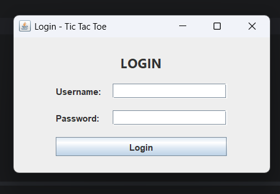
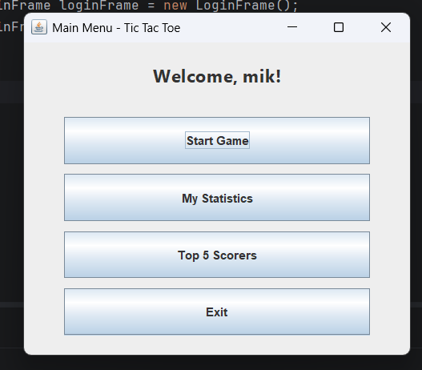
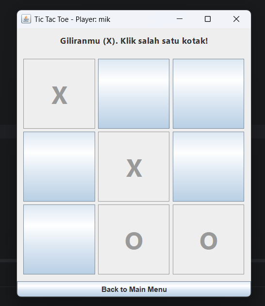
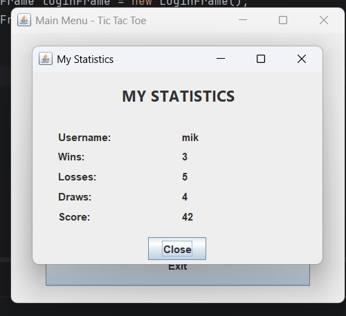
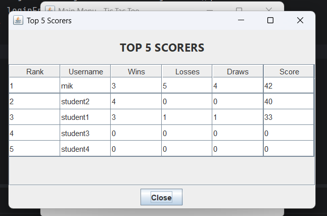

# Simple Tic-Tac-Toe Game with Java Swing, Login, and Statistics

## Student Information
- **Name:** Mike Jordan Marchocellino Kurliando
- **Student ID:** 5026251036
- **Class:** A
- **Course:** ES234211 - Programming Fundamental

## Project Description
This project is a simple Tic-Tac-Toe game built using Java Swing GUI.
The application includes login feature, gameplay, statistics recording,
and Top 5 scorer leaderboard. All player data is stored in a single
PostgreSQL table named `players`.

## Features
- Login authentication using PostgreSQL database
- Play Tic-Tac-Toe (Player as X vs Computer as O)
- Random computer move
- Win, Lose, Draw detection
- Automatic statistics update after each game
- Personal statistics view
- Top 5 scorers leaderboard using JTable

## Scoring System
| Result | Score Change |
|--------|--------------|
| Win    | +10 points   |
| Draw   | +3 points    |
| Lose   | +0 points    |

## Database
- **DBMS:** PostgreSQL 18
- **Database Name:** `game_project`
- **Table:** `players` 

## How to Run

### Prerequisites
1. Java JDK 17 or higher
2. PostgreSQL 18+ installed and running
3. Maven 

### Steps
1. **Setup Database**
    - Open DBeaver/pgAdmin, connect to PostgreSQL
    - Run the SQL script in `database/schema.sql`
2. **Configure DatabaseManager**
    - Open `src/main/java/org/example/DatabaseManager.java`
    - (Change these values based on your database configuration)
    - Update `URL` 
    - Update `PASSWORD` 
3. **Run the application**
    - Open project in IntelliJ IDEA
    - Run `Main.java`

### Default Login (sample users)
| Username | Password |
|----------|----------|
| mik      | 12345    |
| student1 | 12345    |
| student2 | 12345    |

## Class Explanation
- **Main:** Entry point, opens LoginFrame
- **DatabaseManager:** Handles PostgreSQL JDBC connection
- **Player:** Data model (id, username, wins, losses, draws, score)
- **PlayerService:** Login, update statistics, fetch player by ID, fetch Top 5
- **GameLogic:** Board state, move validation, winner check, computer move
- **LoginFrame:** Swing window for username/password input
- **MainMenuFrame:** Swing window with 4 navigation buttons
- **GameFrame:** Swing window for playing Tic-Tac-Toe
- **StatisticsFrame:** Swing window showing personal stats
- **TopScorersFrame:** Swing window showing Top 5 using JTable

## Screenshots

### Login Window

### Main Menu

### Game Window

### My Statistics

### Top 5 Scorers

## Video Demonstration
YouTube: https://youtu.be/5nLoqrTK_ZI
